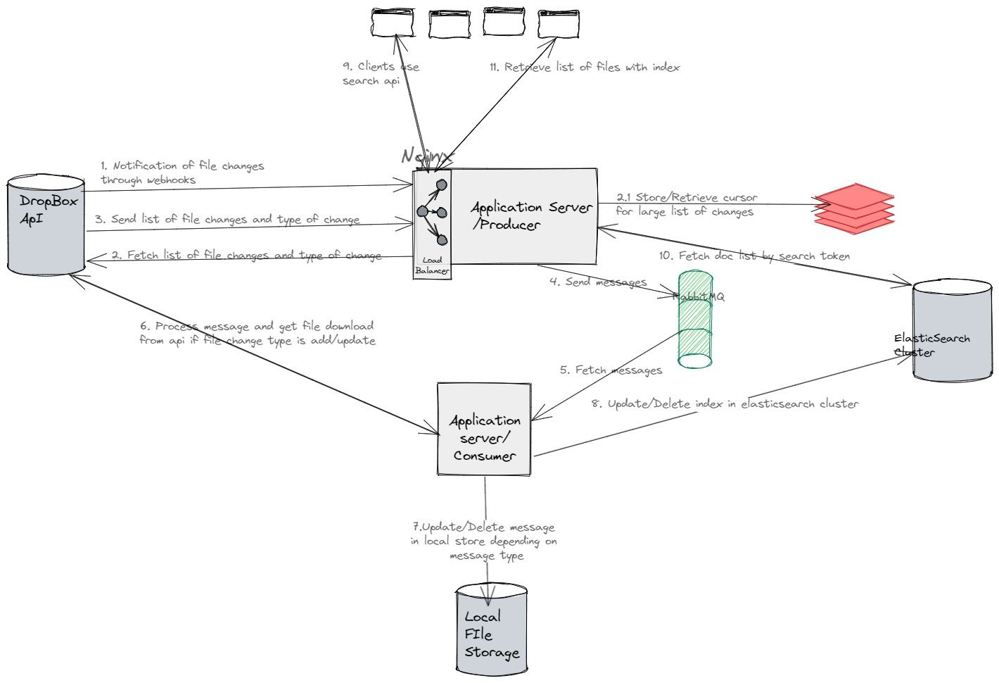

# DropBoxFileFinder
Provides a functionality to search documents from DropBox using keywords.

**Basic Requirements:**

Below are the minimum requirements to install/use the product
> * Python >= 3.10 
> * [ELasticSearch Cluster >= 8.5](https://www.elastic.co/guide/en/elasticsearch/reference/current/install-elasticsearch.html)
> * [JDK >= 7.0 for tika](https://docs.oracle.com/en/java/javase/18/install/overview-jdk-installation.html) 
> * [RabbitMq >= 3.11](https://www.rabbitmq.com/download.html)
> * [DropBox account id](https://www.dropbox.com/developers/documentation/http/documentation#users-get_current_account)
> * [DropBox api auth token](https://developers.dropbox.com/oauth-guide#:~:text=If%20you'd%20like%20to,of%20your%20app%20settings%20page.) 

**Steps for launching this in your own environment:**
* Create a virtual environment and activate it:  
    * `python3 -m ~/testenv`
    * `source ~/testenv/bin/activate`
* Make sure necessary python libraries are installed 
    * `pip3 install -r requirements.txt`
* Launch the project
    * Launch WSGI server for flask web app using command `~/testenv/bin/gunicorn -w 3 dropbox_finder:app`
    * Launch the consumer app. Sample example `~/testenv/bin/python3.10 /root/DropBoxFileFinder/mq_consumer.py`
  

**API Requests:**
Using postman/curl or any suitable clients to make api requests

* Example Search for keywords in all files `http://172.105.36.70/search?query="Architecture"`

**Architecture**

